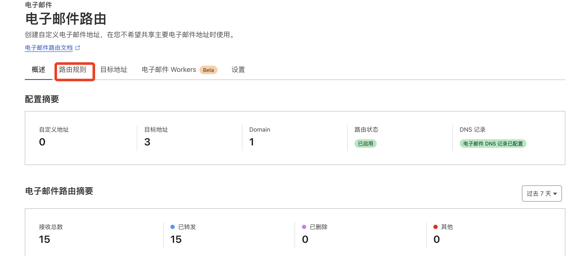
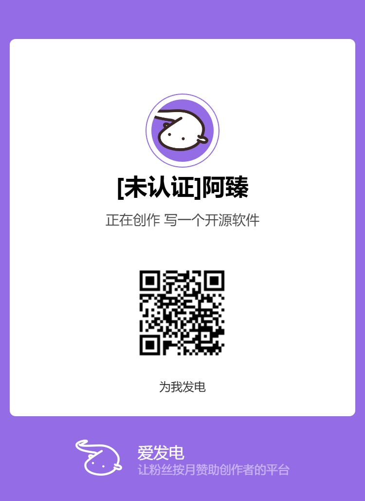

# Cursor Pro Automation Tool User Guide

Automatic account registration, automatic local token refresh, hands-free operation.

## Prerequisites

::: warning How to Get Started Quickly?

1. Make sure Google Chrome browser is installed on your computer. Don't have it? [Click here to download.](https://www.google.cn/intl/en/chrome/)

2. You must be logged in to Cursor Web, regardless of whether the account is valid or not, login is mandatory.

3. Ensure smooth internet connection, preferably with international access. Don't use global proxy!
:::

## Download Link

https://github.com/chengazhen/cursor-auto-free/releases

> Choose according to your computer version. For Mac, make sure to select the corresponding version - Apple Silicon (M chip) users should select ARM64 (aarch64).
> For Mac, you need to make the script executable with the following command:

```shell
chmod +x ./CursorPro
```

Double-click to execute. If you encounter the following situation, [click here for the solution](https://sysin.org/blog/macos-if-crashes-when-opening/)


## Configuration Required Before Using the Script:

1. Using [Temp Mail](https://tempmail.plus/en/#!)
> (1) Host your domain on CF, after hosting, click on Email on the left side. (As shown below)


> Then click on Routing Rules



> Click Edit on the right


> Select "Forward to Email" for Action, fill in your temporary email in the destination


> After CF configuration, download [.env.example](https://github.com/chengazhen/cursor-auto-free)


Rename it to .env. For Mac, if you can't change it, open terminal, cd to your project directory, and use the following command:
```shell
touch .env
```

> After creating the .env file, configure it:
> 
> DOMAIN='xxxxx.me'    # Your email domain
> 
> TEMP_MAIL='xxxxxx'   # Temporary email, the destination you set in Cloudflare

2. Using IMAP instead of tempmail.plus

Configure in the .env file:
```text
DOMAIN='wozhangsan.me'
TEMP_MAIL=null

# IMAP server
IMAP_SERVER=imap.xxxxx.com (e.g., QQ mail, Gmail)
# IMAP SSL port
IMAP_PORT=993  (Google search for ports, QQ is 995, Gmail is 993)
# Email forwarded through CF
IMAP_USER=xxxxxx@xxxxx.com (Your QQ or Gmail, needs to be configured as catch-all in CF, refer to steps above)
# Email authorization code
IMAP_PASS=xxxxxxxxxxxxx
# [Optional] Default is inbox
# You can set it to other folders as long as you can receive mail
IMAP_DIR=
```

## Disclaimer

This tool is for learning and research purposes only, please comply with relevant terms of service. Users assume all responsibility for any consequences arising from the use of this tool. Commercial use of this tool is strictly prohibited, including but not limited to sales, rental, or other profit-making activities. Violations of the license terms will result in corresponding legal liability.

## Buy the Author a Cup of Bubble Tea (To Motivate Updates)

