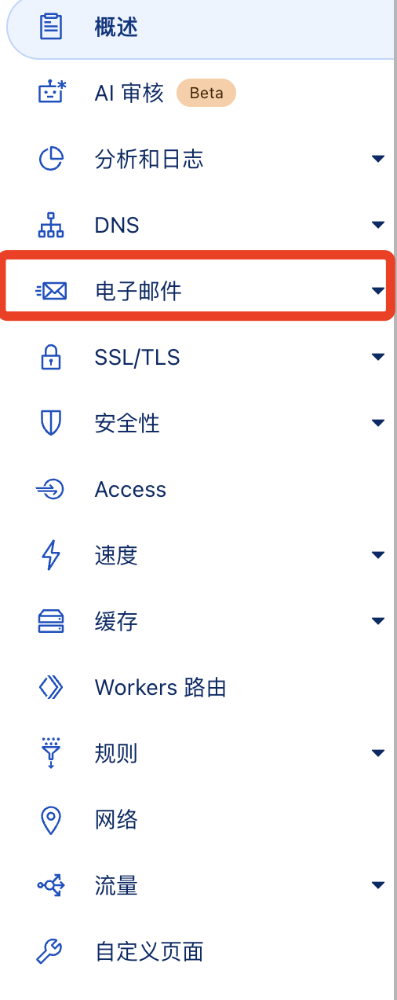
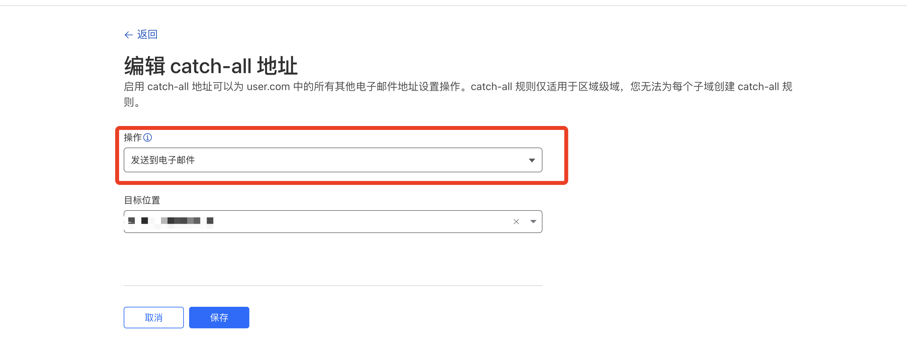

# Cursor Pro Automation Tool Guide

Automatic account registration and local token refresh, completely hands-free operation.

::: warning Important Notes
1. Make sure Google Chrome browser is installed. Need it? [Download here](https://www.google.cn/intl/en/chrome/)
2. You must be logged into Cursor Web, regardless of whether the account is valid
3. Ensure stable internet connection, preferably with international access. **Do not use global proxy**
:::

## Download & Installation

1. Download the latest version from [GitHub Releases](https://github.com/chengazhen/cursor-auto-free/releases)
2. Choose the version for your system:
   - Windows: Download and run `CursorPro.exe` directly
   - Mac (Intel): Choose x64 version
   - Mac (M series): Choose ARM64(aarch64) version

### Additional Steps for Mac Users

1. Open terminal and navigate to the application directory
2. Make the file executable with:
```bash
chmod +x ./CursorPro
```

If you see this security prompt, [click here for the solution](https://sysin.org/blog/macos-if-crashes-when-opening/)


## Configuration

### Method 1: Using tempmail.plus

1. Host your domain on Cloudflare, then click "Email" on the left
   

2. Click "Routing Rules"
   

3. Click "Edit" on the right
   

4. Select "Forward to Email" and enter your tempmail.plus address
   

5. Download [.env.example](https://github.com/chengazhen/cursor-auto-free) and rename it to `.env`
   

::: tip Mac Users Note
If you can't rename, use terminal command:
```bash
touch .env
```
:::

6. Configure your `.env` file:
```bash
DOMAIN='xxxxx.me'    # Your email domain
TEMP_MAIL='xxxxxx'   # Temporary email (tempmail.plus address)
```

### Method 2: Using IMAP

If you prefer using your own email, configure IMAP:

```bash
DOMAIN='wozhangsan.me'
TEMP_MAIL=null

# IMAP Server Configuration
IMAP_SERVER=imap.xxxxx.com  # e.g., QQ Mail, Gmail
IMAP_PORT=993               # QQ: 995, Gmail: 993
IMAP_USER=xxxx@xxxx.com    # Your email address
IMAP_PASS=xxxxxxxxxxxxx    # Email authorization code
IMAP_DIR=                  # [Optional] Default is inbox
```

## Running & Verification

### Windows Users
Double-click `CursorPro.exe` to run

### Mac Users
1. Run in terminal:
```bash
./CursorPro
```
2. Or double-click in Finder

### Verification Steps
1. Wait for the program to complete all operations automatically
2. When you see the "Script execution completed" prompt, restart your editor
3. Verify that the account information shown in the editor matches the account in the script's output log

::: tip Usage Notes
- Ensure stable network connection
- Wait for the program to complete all operations automatically
- Do not use global proxy
:::

## Disclaimer

This tool is for learning and research purposes only. Please comply with relevant terms of service. Users assume all responsibility for any consequences arising from the use of this tool. Commercial use is strictly prohibited, including but not limited to sales, rental, or other profit-making activities. Violations of the license terms will result in corresponding legal liability.

## Support the Author

If this tool helps you, consider buying the author a bubble tea to motivate future updates!

